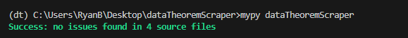
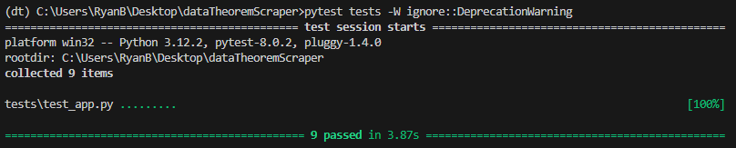

# Aptoide Data Scraper Backend (Data Theorem Job Application Project)

## Objectives

The purpose of this project was to complete all requirements from Data Theorem (outlined in [the requirements](requirements.md)), as part of a backend developer job application.

## Project Architecture

```
dataTheoremScraper
├── .venv (excluded from GitHub)
├── dataTheoremScraper
│   ├── __init__.py
│   ├── api.py
│   ├── app.py
|   └── scraper.py
├── tests
│   ├── __init__.py
|   └── test_app.py
├── static
│   └── index.html
├── mypy-screenshot.png
├── readme.md
├── requirements.md
└── requirements.txt
```

-  All dependencies for the python backend can be found in [requirements.txt](requirements.txt). It should be noted that development was done on a Windows 11 PC; this may have certain consequences for Mac/Linux users (e.g. Mac/Linux users should subtitute [gunicorn](https://docs.gunicorn.org/en/stable/) in place of [waittress](https://docs.pylonsproject.org/projects/waitress/en/stable/)).
-  As outlined in the [requirements](requirements.md), the main objectives are for a simple frontend webpage to allow a user to enter a valid [Aptoide App Store](https://en.aptoide.com/) URL (eg. https://facebook.en.aptoide.com/app), which then makes an API call to a python [Falcon](https://falcon.readthedocs.io/) backend. The backend then scrapes the app's name, version, number of downloads, release date, and description from the website, and returns the data to the frontend webpage, which is then displayed to the user. The main project is subdivided into three documents:

### 1. `scraper.py`

This document contains all the logic for scraping the [Aptoide App Store](https://en.aptoide.com/). The main python modules used to achieve this are [requests](https://requests.readthedocs.io/en/latest/) and [Beautiful Soup](https://beautiful-soup-4.readthedocs.io/en/latest/). Because emphasis was to be placed on producing "production-level" code, one class `AptoideApp` was created, with the intent to store all data (attributes) and functions (methods) related to making a request to the [Aptoide App Store](https://en.aptoide.com/), parsing the HTML, and isolating the desired data. This allows the code in the other documents to be very simple, understandable, and readable.

### 2. `api.py`

This is where all the api routing and resource logic and data are housed, and is almost a verbatim replica of the official [Falcon WSGI tutorial](https://falcon.readthedocs.io/en/3.1.3/user/tutorial.html).

### 3. `app.py`

This is the main document that starts the Falcon application, also adapted from the [Falcon WSGI tutorial](https://falcon.readthedocs.io/en/3.1.3/user/tutorial.html).

## Running the Project

Assuming a Windows machine is used and the project is being run locally:

1. Install python 3.12.
1. Run `pip install virtualenv`
1. Download this repo
1. Create a virtual environment in the same directory as the repo by running `virtualenv <your_env>`, where `<your_env>` is the name of your virtual environment.
1. Activate the virtual environment by running `<your_env>\Scripts\activate`.
1. Run `pip install -r requirements.txt` from inside the root directory `dataTheoremScraper`.
1. Once installation is complete, run `waitress-serve --port=8000 dataTheoremScraper.app:app` from a command prompt inside the root directory `dataTheoremScraper`. This will start the backend application.
1. Go to http://127.0.0.1:8000/ to use the web page. It was provided as a separate resource in the API to prevent local CORS errors, but if the API were actually deployed to the world wide web, then Note that little time was spent on the frontend and only basic functionality is available, since this was outlined in [the requirements](requirements.md). For more sophisticated resources to be served from a Falcon application, something like [Jinja2](https://pypi.org/project/Jinja2/) should be used to serve templated pages with separate JavaScript and CSS files.
1. To manually use the API, go to http://127.0.0.1:8000/api?url=https://example.en.aptoide.com/app, but replace `example` in the URL so it links to an actual Aptoide app (e.g. http://127.0.0.1:8000/api?url=https://facebook.en.aptoide.com/app for the Aptoide Facebook app).

Mac/Linux users will have to use [gunicorn](https://docs.gunicorn.org/en/stable/) in place of [waittress](https://docs.pylonsproject.org/projects/waitress/en/stable/), and follow the [Falcon WSGI tutorial](https://falcon.readthedocs.io/en/3.1.3/user/tutorial.html) for starting a Falcon application with gunicorn.

## Type Checking and Unit Testing

-  As per the requirements, type checking with the `mypy` library and unit tests were included (`pytest` library was used because of familiarity and consistency with the Falcon WSGI tutorial).
-  More unit tests could have potentially been included. Only the most important tests were included, as this was simply a demonstration of ability to include unit testing in a project.
-  Screenshots of the type checking and unit testing results are shown below for reference.

mypy screenshot:



pytest screenshot:



## Future Considerations

Were this an actual production application, the next steps would be to prepare for deployment. Some considerations may include:

-  Solving the Linux/Mac vs. Windows dependencies issue. To solve this, containerization may be useful (e.g. [Docker](https://www.docker.com/)). This would allow the exact same code base and dependencies across all operating systems. It may also simplify the transfer from development to deployment for the same reason.
-  Database considerations. Depending on the intended purpose of the application, storing the scraped data into a database may be useful for aggregating data and also preventing excessive GET requests to https://en.aptoide.com.
-  API documentation. Other backend python frameworks like [Flask](https://flask.palletsprojects.com/en/3.0.x/) or [Django](https://www.djangoproject.com/) have add-on modules that allow for auto-generation of interactive API documentation through add-on libraries like [flask-swagger](https://pypi.org/project/flask-swagger/) or [drf-spectacular](https://drf-spectacular.readthedocs.io/en/latest/) that take route function docstrings and object schema to generate interactive API documentation.
-  All unit tests were written in a single file, `tests\test_app.py`. In the future, unit tests should be separated and grouped into separate files when the number of tests increases. Given that there was only one endpoint and a small number of unit tests overall however, all tests were written into just one file for the purposes of convenience.

## Closing Remarks

-  I enjoyed working on this project compared to other DSA-style technical interviews and projects. At the very least, I now have an end-to-end project that I can include in my portfolio, so it doesn't feel like a waste of time (even if I don't get the job). I also feel like this was a more practical demonstration of skills (actually building something, versus solving LeetCode questions). Thank you [@DataTheorem](https://www.linkedin.com/company/datatheorem/)!
-  There was some conflicting requirements information between the Goal section ("Build a functional web application using Python, and any framework/library you are comfortable with.") and the Additional Requirements section ("Please use Falcon to write your API endpoint(s). Other web frameworks such as Django, Django REST or Flask are not allowed for this exercise."). My feedback would be to include the Falcon requirement in the Goal section, so when the first email is sent to candidates (which includes just the Overview section), they can begin reading up on Falcon and familiarizing themselves before beginning the project. This may be intentional to see if potential candidates can learn a new framework in a timely manner and also test whether candidates can read documentation. In this case, the "any framework/library you are comfortable with" part should be removed from the Overview so candidates don't come into the project expecting that they can use Django or Flask. Nevertheless, I found the Falcon framework was very well documented and provided an excellent example (so learning to use Falcon was very easy). Though I stated my feedback, given that I was able to complete the project well within the one-week time limit, I don't think any part of this project was unreasonable.
